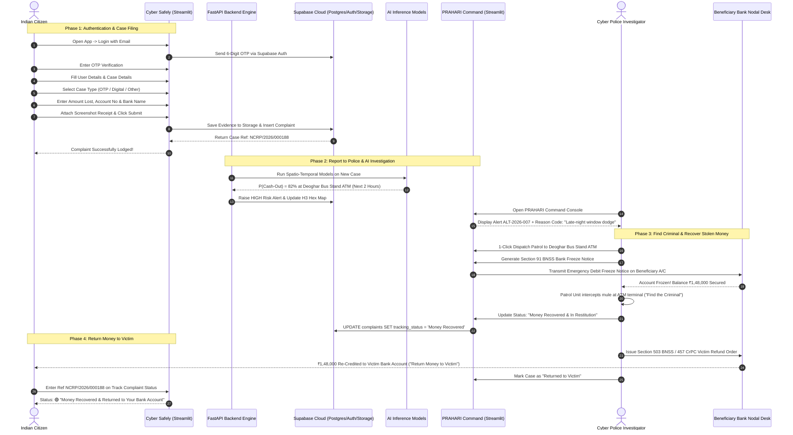

# PRAHARI & CYBER SAFELY: Predictive Cybercrime Cash-Out Forecasting & Citizen Protection
## Document 03: Workflow and Application Flow Document

---

### 1. Core Master Application Flows

PRAHARI & Cyber Safely is governed by two fundamental master flows designed to give citizens immediate awareness and deliver end-to-end victim restitution.

#### 1.1 Master Flow 1: Phishing & Fraud Link Verification ("Cyber Safely")
```
┌──────────────────────────────────────────────────┐
│                      START                       │
└────────────────────────┬─────────────────────────┘
                         │
                         ▼
             ┌───────────────────────┐
             │  Enter Website Link   │
             └───────────┬───────────┘
                         │
                         ▼
             ┌───────────────────────┐
             │  App Checks the Link  │
             │ (Hybrid Threat Engine)│
             └───────────┬───────────┘
                         │
                         ▼
             ┌───────────────────────┐
             │ Real Link or Fake Link│
             └───────────┬───────────┘
                         │
                         ▼
             ┌───────────────────────┐
             │      Show Result      │
             │(Awareness + DOs/DONTs)│
             └───────────┬───────────┘
                         │
                         ▼
┌──────────────────────────────────────────────────┐
│                       END                        │
└──────────────────────────────────────────────────┘
```

---

#### 1.2 Master Flow 2: End-to-End Criminal Apprehension & Victim Restitution
```
┌──────────────────────────────────────────────────┐
│                      START                       │
└────────────────────────┬─────────────────────────┘
                         │
                         ▼
             ┌───────────────────────┐
             │       Open App        │
             └───────────┬───────────┘
                         │
                         ▼
             ┌───────────────────────┐
             │         Login         │
             └───────────┬───────────┘
                         │
                         ▼
             ┌───────────────────────┐
             │   OTP Verification    │
             │  (Supabase Email OTP) │
             └───────────┬───────────┘
                         │
                         ▼
             ┌───────────────────────┐
             │   Fill User Details   │
             │ (Name, Email, Phone)  │
             └───────────┬───────────┘
                         │
                         ▼
             ┌───────────────────────┐
             │   Fill Case Details   │
             │ (Date, Evidence Slip) │
             └───────────┬───────────┘
                         │
                         ▼
             ┌───────────────────────┐
             │   Select Case Type    │
             │(OTP / Digital / Other)│
             └───────────┬───────────┘
                         │
                         ▼
             ┌───────────────────────┐
             │   Enter Amount Lost   │
             └───────────┬───────────┘
                         │
                         ▼
             ┌───────────────────────┐
             │ Enter Account Number  │
             │ (Victim & Beneficiary)│
             └───────────┬───────────┘
                         │
                         ▼
             ┌───────────────────────┐
             │    Enter Bank Name    │
             └───────────┬───────────┘
                         │
                         ▼
             ┌───────────────────────┐
             │   Submit Complaint    │
             │(NCRP Reference Number)│
             └───────────┬───────────┘
                         │
                         ▼
             ┌───────────────────────┐
             │ Send Report to Police │
             │& Investigation Officer│
             │(PRAHARI Command Alert)│
             └───────────┬───────────┘
                         │
                         ▼
             ┌───────────────────────┐
             │     Investigation     │
             │(H3 Hex Map & Forecast)│
             └───────────┬───────────┘
                         │
                         ▼
             ┌───────────────────────┐
             │   Find the Criminal   │
             │(ATM Patrol Intercept) │
             └───────────┬───────────┘
                         │
                         ▼
             ┌───────────────────────┐
             │ Recover Stolen Money  │
             │(Emergency Bank Freeze)│
             └───────────┬───────────┘
                         │
                         ▼
             ┌───────────────────────┐
             │Return Money to Victim │
             │ (Account Restitution) │
             └───────────┬───────────┘
                         │
                         ▼
┌──────────────────────────────────────────────────┐
│                       END                        │
└──────────────────────────────────────────────────┘
```

---

### 2. Cross-System Architecture & Operational Synchronization

This diagram illustrates how the AI predictive engine bridges the gap between **Investigation**, **Finding the Criminal**, and **Recovering the Stolen Money**:



---

### 3. Detailed Screen Walkthroughs

#### 3.1 Citizen Journey: "Cyber Safely"

##### Flow C-1: Email OTP Login
1. Citizen navigates to the app. A clean login card is displayed with the title: **"Cyber Safely — Citizen Protection Portal"**.
2. Citizen enters their email address and clicks `Send Login Code (OTP)`.
3. Supabase Auth emails a 6-digit OTP code.
4. Citizen types the OTP code and clicks `Verify & Proceed`.
5. Streamlit stores the authenticated session in `st.session_state["citizen_authenticated"] = True`.

##### Flow C-2: Phishing Link Checker ("Cyber Safely Awareness")
1. Citizen clicks the **Check Suspicious Link** tab.
2. A prominent URL input field appears: *"Received a suspicious message or link on WhatsApp / SMS? Paste it here before clicking."*
3. Citizen pastes a link (e.g. `http://sbi-reward-kyc.top/claim-bonus.apk`) and clicks `Analyze Link Security`.
4. The system executes the hybrid lexical and threat check in under 300ms.
5. If fake:
   * A full-width crimson danger box renders:
     * **Verdict:** `🚨 High-Risk Phishing Link Detected`
     * **Reason:** Deceptive domain impersonating State Bank of India (`sbi`) using an untrusted `.top` domain and targeting credential harvesting.
     * **Awareness Advice:** *"Never enter your Net Banking User ID, Password, or OTP on this website. Do not download any APK files."*
6. If safe:
   * An emerald green box displays: *"No immediate fraud patterns detected. Always ensure the browser lock icon shows https://."*

##### Flow C-3: Report a Cybercrime & Evidence Upload
1. Citizen clicks **Report Cybercrime**.
2. Form fields are organized into clear progressive cards:
   * **Incident Typology:** Dropdown (`OTP fraud`, `Digital arrest`, `Job fraud`, `UPI fraud`, `Investment scam`, `Loan app extortion`).
   * **Financial Impact:**
     * Lost Amount (INR): `₹1,48,000`
     * Victim Bank: `State Bank of India`
     * Victim Account Number: `XXXXXX1290`
     * Victim District: `Pune`
   * **Suspect Information (if known):**
     * Beneficiary Bank: `Bank of India`
     * Suspect Account / UPI ID: `XXXXXX4921` / `paytm-mule@okaxis`
     * Suspect Withdrawal Location / District: `Deoghar`
   * **Evidence Attachment:** File uploader accepting screenshots (`.png`, `.jpg`) or PDF transaction slips.
3. Citizen clicks `Submit Official Cyber Complaint`.
4. The system uploads evidence to Supabase Storage bucket `complaint-evidence`, writes the complaint to Supabase `complaints`, and displays:
   * **Success Badge:** `Complaint Lodged Successfully!`
   * **Your Case Reference:** `NCRP/2026/000188` (Save this number to track your case).
   * **Emergency Note:** *"If this fraud occurred in the last 2 hours, also immediately dial 1930 Helpline."*

##### Flow C-4: Track Complaint Status (End-to-End Restitution Progress)
1. Citizen clicks **Track Complaint Status**.
2. Enters Reference Number: `NCRP/2026/000188` and clicks `Track Status`.
3. System returns the **Simple Status Badge** with the exact recovery milestone:
   * `🟡 Under Review` (Complaint received and undergoing AI spatio-temporal correlation).
   * `🟠 Investigation Active` (Patrol alerted to ATM cash-out zone; Bank Freeze Notice issued).
   * `🔵 Criminal Traced / Money Recovered` (Mule intercepted; Stolen funds frozen in beneficiary account).
   * `🟢 Money Returned to Victim` (Funds re-credited to victim bank account via court restitution order).

##### Flow C-5: View Safety Guidance
1. Citizen clicks **Cyber Safety Guidance**.
2. **Golden Hour Advisory Box:** Explains the 2-hour recovery window and provides a one-tap link to dial `1930`.
3. **Interactive Typology Guidance Cards:**
   * *OTP Frauds:* Bank officers never ask for OTP. Never share screen via AnyDesk/TeamViewer.
   * *Digital Arrest Scams:* Police or CBI never conducts interrogations or arrests via Skype/WhatsApp video calls.
   * *Part-Time Job Scams:* No legitimate company asks for deposit money to complete Telegram review tasks.

---

#### 3.2 Investigator Journey: "PRAHARI Command"

1. In the header bar, an authorized officer toggles the view to **"PRAHARI Command"** (or logs in with officer credentials).
2. The officer enters the dark tactical console:
   * Views live complaints including newly reported citizen cases.
   * Inspects the **Predictive Hotspot Map** (H3 Resolution 7/8 hexagons) to see which ATM clusters have elevated cash-out probability for the next 6 hours.
   * Triage alerts with plain-English reason codes.
   * Generates a 1-click **Section 91 BNSS Bank Freeze Notice** to dispatch to the beneficiary bank nodal officer.
   * Once funds are frozen and the patrol intercepts the mule, the officer transitions the case status from `Investigation Active` $\to$ `Money Recovered` $\to$ `Returned to Victim`, completing the justice cycle!
